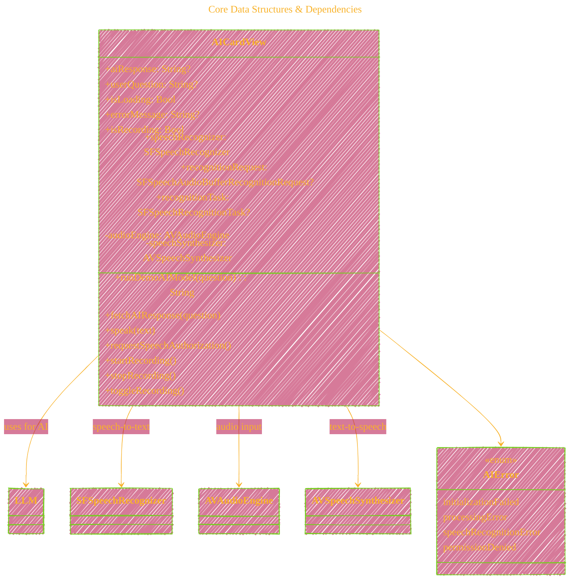

# Semantic Review and Visual Explanation of `ChatWithLocalBot_V5.swift`
# 
> **Disclaimer:**
>
> This document contains my personal notes on the topic,
> compiled from publicly available documentation and various cited sources.
> The materials are intended for educational purposes, personal study, and reference.
> The content is dual-licensed:
> 1. **MIT License:** Applies to all code implementations (Swift, Mermaid, and other programming languages).
> 2. **Creative Commons Attribution 4.0 International License (CC BY 4.0):** Applies to all non-code content, including text, explanations, diagrams, and illustrations.
---


Below is a thorough semantic analysis of the given Swift file, followed by a **collection of concise, interconnected Mermaid diagrams**. These diagrams break down complex flows, architectures, and interactive patterns in the code, covering UI/UX, AI/voice integration, permission and state management, and 
error handling.

---

## 1. Semantic Review: Key Components and Flow

### A. Architectural Overview

- **`AICardView`** is a SwiftUI View that serves as a chat interface for asking questions *by voice* in Vietnamese, and then relaying the response from a local LLM (Large Language Model).
- **Voice functionality** is two-fold:
    - **Speech-to-Text**: Converts user's spoken Vietnamese question to text via **Speech framework** (SFSpeechRecognizer & AVAudioEngine).
    - **Text-to-Speech**: Reads out the AI's answer aloud using **AVSpeechSynthesizer**.
- The **AI logic** uses a local model (TinyLlama/Arcee-VyLinh, quantized) loaded via a `LLM` abstraction and queried asynchronously.
- Extensive **state management** ensures:
    - User's question and AI's answer are displayed and voiced,
    - Loading, error, and permission states are clearly presented to the user.
- **Permissions** for both speech recognition and microphone usage are requested and handled.
- **Error handling** is structured and user-facing, using custom error types (`AIError`) with localized descriptions.

### B. Core Functional Flow

1. **User taps mic button**:
    - If not recording:
        - Microphone and speech permissions checked/requested.
        - Recording starts and transcribes user's question in Vietnamese.
    - If recording:
        - Recording stops, final transcription is produced.
2. **On final transcription**:
    - The transcribed question is sent asynchronously to the local LLM.
    - Spinner/progress shows during processing.
    - AI's response is displayed AND spoken aloud via TTS.
3. **Error management**:
    - At any stage (permission denied, recording issues, LLM errors), clear error messages appear in the card.

---

## 2. Visual Explanations (Mermaid Diagrams)


### A. Top-Level App Architecture

```mermaid
---
title: "Top-Level App Architecture"
author: "Cong Le"
version: "1.0"
license(s): "MIT, CC BY 4.0"
copyright: "Copyright (c) 2025 Cong Le. All Rights Reserved."
config:
  layout: dagre
  theme: base
---
%%%%%%%% Mermaid version v11.4.1-b.14
%%%%%%%% Available curve styles include the following keywords:
%% basis, bumpX, bumpY, cardinal, catmullRom, linear, monotoneX, monotoneY, natural, step, stepAfter, stepBefore.
%%{
  init: {
    'flowchart': { 'htmlLabels': false, 'curve': 'linear' },
    'fontFamily': 'Fantasy,Monaco',
    'themeVariables': {
      'primaryColor': '#2FB1',
      'primaryTextColor': '#F8B229',
      'lineColor': '#F8B229',
      'primaryBorderColor': '#27AE60',
      'secondaryColor': '#EEF2',
      'secondaryTextColor': '#6C3483',
      'secondaryBorderColor': '#A569BD',
      'fontSize': '20px'
    }
  }
}%%
flowchart TD
    AICardView["AICardView<br/>(SwiftUI Card)"]
    subgraph VoiceInteraction
        SR["Speech-to-Text<br/>(SFSpeechRecognizer, AVAudioEngine)"]
        TTS["Text-to-Speech<br/>(AVSpeechSynthesizer)"]
    end
    AI["Local LLM<br/>(TinyLlama /<br/> Arcee-VyLinh via LLM API)"]
    %% User["User<br/>(Speaks Question)"]

	My_Meme@{ img: "https://raw.githubusercontent.com/CongLeSolutionX/MY_GRAPHIC_ASSETS/refs/heads/Designing_graphic_syntax/MY_MEME/My-meme-icon-design.png", label: "User<br/>(Speaks Question)", pos: "b", w: 100, h: 100, constraint: "on" }


    Permissions["Permission Handling<br/>(Speech & Microphone)"]
    UIState["UI State Management<br/>(Loading, Errors, Display)"]

    My_Meme -->|"Taps mic, speaks"| AICardView
    AICardView --> Permissions
    AICardView --> SR
    SR -->|"transcription"| AICardView
    AICardView -->|"query"| AI
    AI -->|"AI answer"| AICardView
    AICardView --> TTS
    TTS -->|"audio out"| My_Meme
    AICardView --> UIState
    UIState --> AICardView
    
```

- **Legend**: All flows are mediated by the `AICardView`, which orchestrates user input, permissions, AI calls, and output.

---

### B. UI State Machine: What the User Sees


---

### C. Detailed Sequence: Voice-to-AI-to-Voice Pipeline


---

### D. AIModel Loading and Error Handling


---

### E. Speech Recognition Flow

```mermaid
---
title: "Speech Recognition Flow"
author: "Cong Le"
version: "1.0"
license(s): "MIT, CC BY 4.0"
copyright: "Copyright (c) 2025 Cong Le. All Rights Reserved."
config:
  layout: dagre
  theme: base
---
%%%%%%%% Mermaid version v11.4.1-b.14
%%%%%%%% Available curve styles include the following keywords:
%% basis, bumpX, bumpY, cardinal, catmullRom, linear, monotoneX, monotoneY, natural, step, stepAfter, stepBefore.
%%{
  init: {
    'flowchart': { 'htmlLabels': false, 'curve': 'linear' },
    'fontFamily': 'Fantasy,Monaco',
    'themeVariables': {
      'primaryColor': '#2FB1',
      'primaryTextColor': '#F8B229',
      'lineColor': '#F8B229',
      'primaryBorderColor': '#27AE60',
      'secondaryColor': '#EDE2',
      'secondaryTextColor': '#6C3483',
      'secondaryBorderColor': '#A569BD',
      'fontSize': '20px'
    }
  }
}%%
flowchart TD
	My_Meme@{ img: "https://raw.githubusercontent.com/CongLeSolutionX/MY_GRAPHIC_ASSETS/refs/heads/Designing_graphic_syntax/MY_MEME/My-meme-icon-design.png", label: "User taps mic", pos: "b", w: 100, h: 100, constraint: "on" }
	
    My_Meme --> CheckPerm["Check Speech &<br/> Mic Permissions"]
    CheckPerm -- authorized --> SetupAudio["Setup AVAudioEngine"]
    SetupAudio --> StartRecogSession["Create recognition request & task"]
    StartRecogSession --> Listening["Listen & transcribe..."]
    Listening -- partial results --> UpdateUI["Update displayed question"]
    Listening -- user stops/auto final --> Finalize["Stop recording"]
    Finalize --> IsTextFinal["Is transcription final <br/>& non-empty?"]
    IsTextFinal -- Yes --> FetchAI["Call AI with question"]
    IsTextFinal -- No --> ShowError["Show 'no voice detected' error"]
    CheckPerm -- "denied/<br/>error" --> ShowError
    Listening -- mic/audio error --> ShowError
```

---

### F. Error Handling Map


---

### G. Core Data Structures & Dependencies



---

### H. Permissions Decision Tree


---

### I. Data & UI State Synchronization


---

### J. Quantization Model Impact (AI Loading)


*Shows developer’s comments on memory/quality tradeoffs.*

---

## 3. Concept Map: End-to-End User Journey


---

# Summary Table

| Aspect                         | Visual Diagram | Concepts Illustrated                                |
|---------------------------------|---------------|-----------------------------------------------------|
| **Overall Data Flow**           | A             | All moving parts: UI, AI, speech, permissions       |
| **UI State Transitions**        | B             | States: idle, recording, processing, error, answer  |
| **Interaction Sequence**        | C             | Timeline and message sequence for a user action     |
| **AI Model Handling**           | D             | Model initialization, error branches                |
| **Speech Recognition Details**  | E             | Stepwise logic from tap to transcription & error    |
| **Error Handling**              | F             | Mapping errors to user-facing UI                    |
| **Class & State Structure**     | G             | Objects, state variables, dependencies              |
| **Permissions Logic**           | H             | Nested permission checks and outcomes               |
| **State Synchronization**       | I             | UI updates and their triggers                       |
| **LLM Quantization Choice**     | J             | Memory/quality tradeoffs in LLM selection           |
| **User Journey**                | Journey Map   | Bird’s-eye view of app usage scenario               |

---

## How to Read These Diagrams

- **Flowcharts:** Show logical or data pathways and choices.
- **State diagrams:** Depict how the UI state changes with actions or results.
- **Sequence diagrams:** Clarify interaction timeline and message flow between components and actors.
- **Class diagrams:** Map out how code entities connect.
- **Journey diagrams:** Visualize the high-level user-centered journey.
- **Quantization tradeoff:** Relates a developer concern.

---

## Final Thoughts

This implementation is a rich, modern example of bridging **speech, AI, stateful UI, and error handling** in SwiftUI. The diagrams collectively capture not just "how" the individual parts work, but **how the entire user experience is woven together**—from permissions and state management, through asynchronous voice and AI handling, to final user output and interactivity. 


---

*These diagrams can be embedded in your documentation, onboarding materials, or code comments to make codebases like this approachable for teams and stakeholders alike.*


---


<!-- 


---
>**Licenses:**
>
>- **MIT License:**  [](LICENSE) - Full text in [LICENSE](LICENSE) file.
>- **Creative Commons Attribution 4.0 International:** [](LICENSE-CC-BY) - Legal details in [LICENSE-CC-BY](LICENSE-CC-BY) and at [Creative Commons official site](http://creativecommons.org/licenses/by/4.0/).