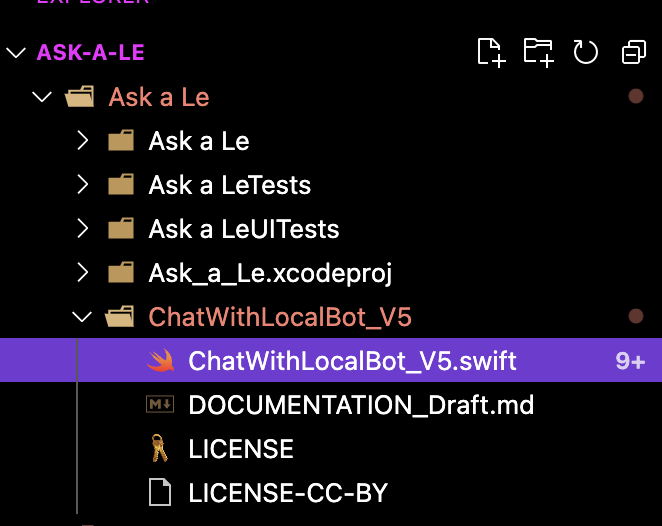
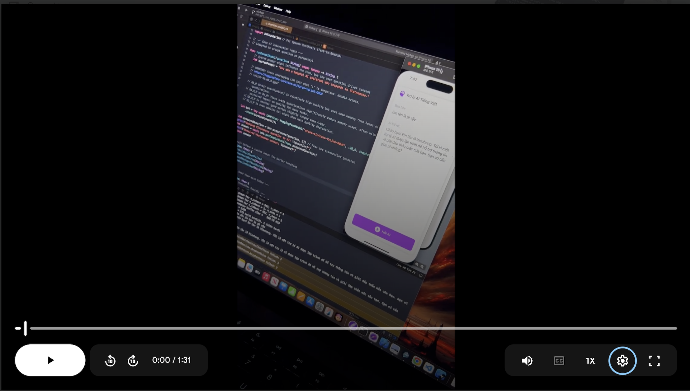

# Ask-a-Le

---

This repo is the code implementation of the research project [On_device_real_time_AI_assistant](https://github.com/CongLeSolutionX/On_device_real_time_AI_assistant)

## Research Paper

This project is documented in detail in our arXiv publication. For a comprehensive understanding of the methodology, experiments, and findings, please refer to:

📄 **Privacy-Preserving Real-Time Vietnamese-English Translation on iOS Devices Using Edge AI and On-Device LLMs**

*   **arXiv Abstract & PDF:** [arXiv:2505.07583](https://arxiv.org/abs/2505.07583)
*   **Direct HTML View:** [Read Online (HTML)](https://arxiv.org/html/2505.07583v1)
*   

---

This code implementation project is still under-contruction.

-----

<table style="border: none; border-collapse: collapse;">
  <tr style="border: none;">
    <td style="border: none; padding: 5px;">
      
    </td>
    <td style="border: none; padding: 5px;">
      
    </td>
    <td style="border: none; padding: 5px;">
      
    </td>
  </tr>
</table>

<table style="border: none; border-collapse: collapse;">
  <tr style="border: none;">
    <td style="border: none; padding: 5px;">
      
    </td>
    <td style="border: none; padding: 5px;">
      
    </td>
    <td style="border: none; padding: 5px;">
      
    </td>
  </tr>
</table>

---

The source code for `ChatWithLocalBot_V5` is inside the path below: 

---

## Demo video for ChatWithLocalBot - V5

---

----
